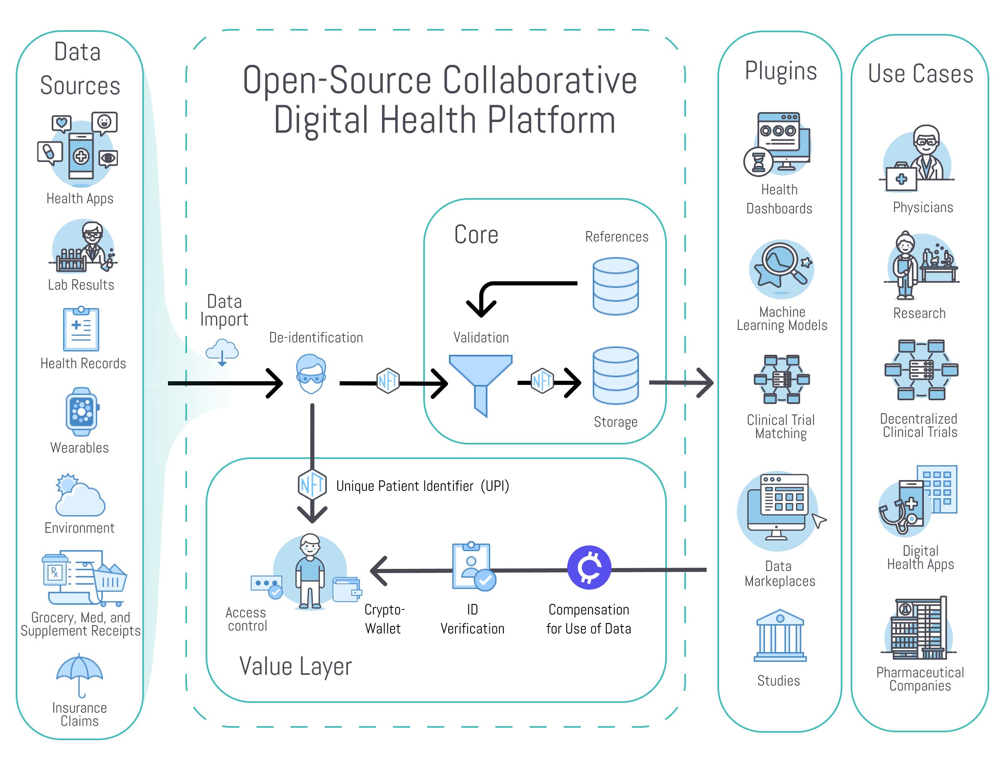
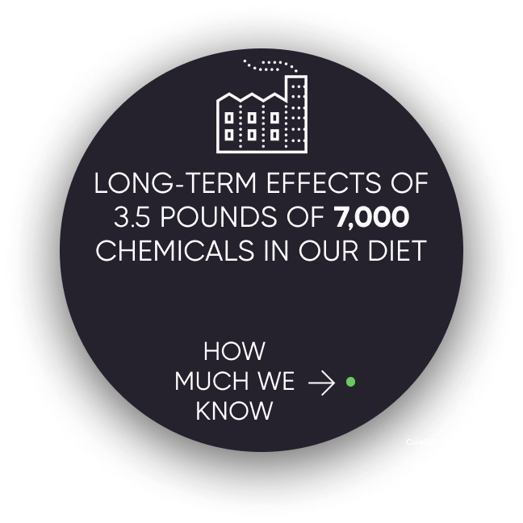
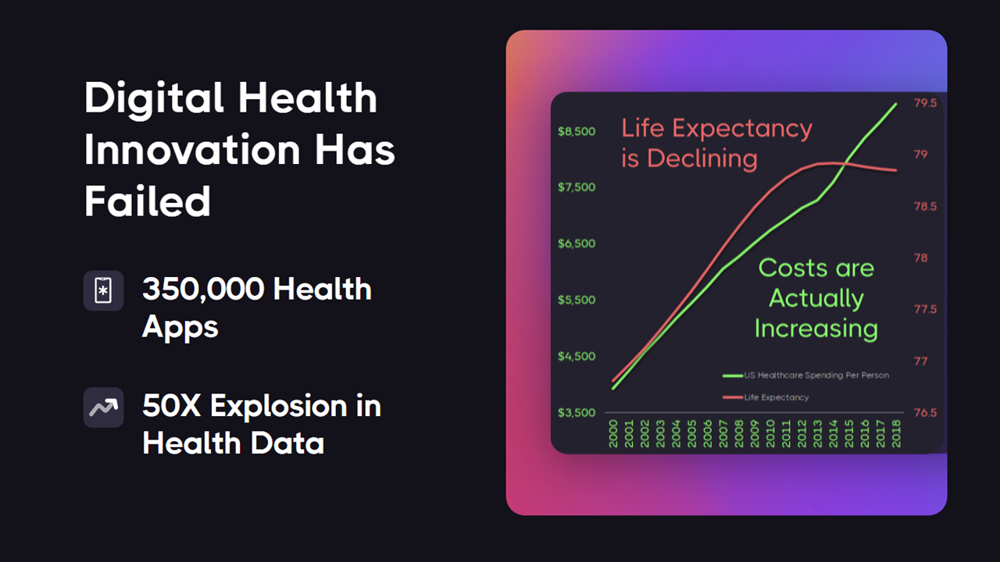
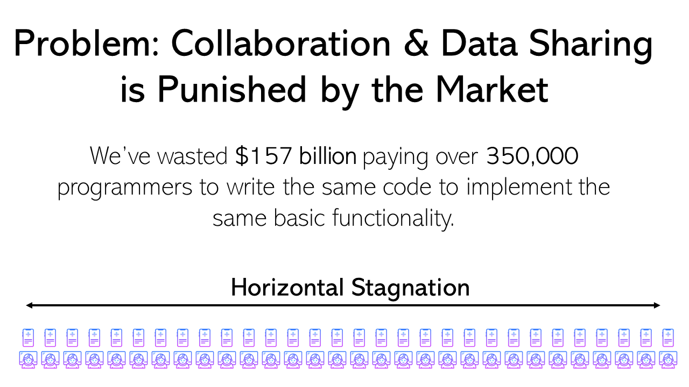
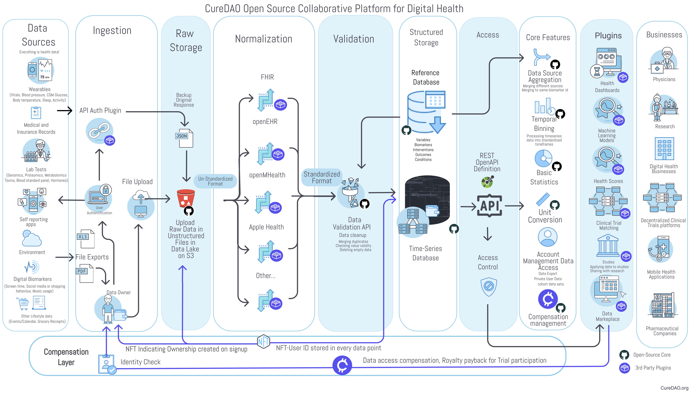

# 💡 Litepaper

## tl;dr

**Question:** How can we have a massive explosion in health data and digital health technology and have no improvement in lifespan or reduction in costs?

**Answer:** Gross inefficiency and data hoarding.

Over 350,000 digital health developers are ultimately trying to improve human health and wasting billions of dollars 💸 and billions of hours ⏳ building the same features. We have a market incentive structure that punishes open-source cooperation, and data sharing and 💰 rewards closed, proprietary, and wasteful duplication of effort.

**Solution:** An open platform for clinical research that incentivizes cooperation and data sharing.

CureDAO utilizes a new meritocratic economic system of Collaborationism that will transcend the incentivization failures and inefficiencies of previous economic models such as Communism and Capitalism. The CureDAO incentive structure overcomes the traditional collaboration and data sharing barriers by encoding contributions through non-fungible tokens (NFTs). Using smart contracts, the platform will compensate all contributors of work, data, and IP with ongoing royalties.

Our hypothesis (and dream) is that this new system can accelerate the rate of clinical discovery 350,000 times 🚀️ and create a world where suffering is optional. 😃

But we can't realize this dream without you!

#### **👉** [**Join Us Right Now!**](https://info.curedao.org/join-us)

Hmm. You're still here, so I guess you're not convinced. 😕 Then venture on, dear reader!

## The WordPress of Health Data

Our first project is a community-owned, open-source, no-code platform for health data aggregation and analysis.

It will provide a basic foundational technology layer to remove barriers for physicians, researchers, clinicians, and developers of digital health applications.

It consists of two primary components:

### 1. The Core Open-Source Platform

* Storage
* Security
* Access Control
* De-identified Data Sharing
* API with Advanced Querying Capabilities

### 2. The 3rd Party Plugin Framework

* Data import from any source
* Data Format Transformation
* Data visualizations
* Machine learning algorithms
* Data analysis
* Personalized Health Dashboards

Our novel incentive structure overcomes the traditional collaboration and data sharing barriers by encoding contributions through non-fungible tokens (NFTs). Using smart contracts, the platform will compensate all contributors with royalties.

## 💡 Litepaper

### :skull\_crossbones: Problem: You and Everyone You Love Will Suffer and Die

Over [2 billion](https://www.george-health.com/global-health-challenge/) people are suffering and [150,000](https://www.weforum.org/agenda/2020/05/how-many-people-die-each-day-covid-19-coronavirus/) people die every single day from preventable diseases. For perspective, this is equivalent to:

* [**FIFTY-ONE**](https://en.wikipedia.org/wiki/Casualties\_of\_the\_September\_11\_attacks) September 11th attacks every day
* [**NINE**](https://www.haaretz.com/israel-news/6-million-where-is-the-figure-from-1.10570907) Holocausts every year

### 💡 Solution: A Collaborative Framework for Personalized, Precision Health

The solution is to use the oceans of real-world evidence to accelerate the discovery of new cures and reveal hidden causes of disease.

The human body can be viewed as a black box with inputs (like diet, treatments, etc.) and outputs (like symptom severity). We're creating a mathematical model of human biology to determine the input factors and values that produce optimal health outcomes.

.png>)

#### The Potential of the Oceans of Real-World Evidence

* **Discovering Hidden Causes of Illness** - Data mining and analysis to identify hidden factors in our daily life that are making us sicker
* **Preventative medicine** - Predictive analytics and data analysis of genetic, lifestyle, and social circumstances to prevent disease
* **Precision medicine** - Leveraging aggregate data to determine the precise treatments and dosages for your unique biology
* **Accelerated Treatment Discovery** - Data-driven medical and pharmacological research to discover new treatments and medicines
* **Reduction of adverse medication events** - Harnessing big data to spot medication errors and flag potential adverse reactions
* **Cost reduction** - Driving better patient outcomes for long-term savings through prevention and avoidance of expensive and ineffective treatments
* **Population health** - Identify health strategies based on demographic, geographic, and socioeconomic trends

### Why Clinical Research Has Failed

It takes over [10 years and $2.6 billion](https://www.semanticscholar.org/paper/Innovation-in-the-pharmaceutical-industry%3A-New-of-DiMasiGrabowski/3275f31c072ac11c6ca7a5260bd535720f07df41) to bring a drug to market (including failed attempts). It costs [$41k](https://www.clinicalleader.com/doc/getting-a-handle-on-clinical-trial-costs-0001#:\~:text=The%20clinical%20trials%20cost%20a,and%20benchmarking%20clinical%20trial%20costs.) per subject in Phase III clinical trials.

The high costs lead to:

**1. No Data on Unpatentable Molecules**

We still know next to nothing about the long-term effects of 99.9% of the 4 pounds of over [7,000](https://www.dailymail.co.uk/health/article-8757191/Are-additives-food-making-ill.html) different synthetic or natural compounds. This is because there's only sufficient incentive to research patentable molecules.

**2. Lack of Incentive to Discover Every Application of Off-Patent Treatments**

Most of the known diseases (approximately 95%) are classified as rare diseases. Currently, a pharmaceutical company must predict particular conditions to treat before running a clinical trial. Suppose a drug is effective for other diseases after the patent expires. In that case, there isn't a financial incentive to get it approved for the different conditions.

**3. No Long-Term Outcome Data**

It's not financially feasible to collect a participant's data for years or decades. Thus, we don't know if the long-term effects of a drug are worse than the initial benefits.

**4. Negative Results Aren't Published**

Pharmaceutical companies tend to only report "positive" results. That leads to other companies wasting money repeating research on the same dead ends.

**5. Trials Exclude a Vast Majority of The Population**

One investigation found that only [14.5%](https://www.ncbi.nlm.nih.gov/pubmed/14628985) of patients with major depressive disorder fulfilled eligibility requirements for enrollment in an antidepressant trial. Furthermore, most patient sample sizes are very small and sometimes include only 20 people.

**6. We Only Know 0.000000002% of What is Left to be Researched**

The more research studies we read, the more we realize we don't know. Nearly every study ends with the phrase "more research is needed".

If you multiply the [166 billion](https://www.nature.com/articles/549445a) molecules with drug-like properties by the [10,000](https://www.washingtonpost.com/news/fact-checker/wp/2016/11/17/are-there-really-10000-diseases-and-500-cures/) known diseases, that's 1,162,000,000,000,000 combinations. So far, we've studied [21,000 compounds](https://www.centerwatch.com/articles/12702-new-mit-study-puts-clinical-research-success-rate-at-14-percent). That means we only know 0.000000002% of the effects left to be discovered.

### Why Digital Health Innovation Has Failed

#### Duplication of Effort

Despite this massive growth in health data and innovation, we've seen increased costs and disease burden and decreased life expectancy.

The reason is awful **incentives**. There are more than [350,000](https://www.emarketer.com/content/over-350k-digital-health-apps-flooding-market-here-s-how-apps-stand) health apps, and each costs an average of [$425,000](https://www.mobihealthnews.com/content/mobile-health-app-development-costs-425000-average-likely-continuing-rise) to develop. Most have significant overlap in functionality, representing a cost of [$157,500,000,000](https://www.mobihealthnews.com/content/mobile-health-app-development-costs-425000-average-likely-continuing-rise) on duplication of effort.

Isolated streams of health data can only tell us about the past. For example, dashboards filled with descriptive statistics such as our daily steps or sleep.

.PNG>)

If this data and innovation efforts were combined, this could increase the rate of progress by 350,000 times.

.PNG>)

The obstacle has been the free-rider problem. Software developers that open source their code give their closed-source competitors an unfair advantage, increasing their likelihood of bankruptcy.

**How to Overcome the Free-Rider Problem**

1. **Government Grants** - Currently, governments spend billions funding closed-source propriety health software. The Public Money, Public Code initiative requires governments to recognize software as a [public good](https://en.wikipedia.org/wiki/Public\_good\_\(economics\)) that is open source. This would lead to a massive influx in grant funding for open-source digital health projects.
2. **Open-Source Royalty Compensation** - By encoding contributions to the project with NFTs, we can provide ongoing royalty payments to open-source contributors.
3. **Licensing** - The project core framework will be open-source for any non-commercial purpose. However, we will utilize a [Fair-code](https://faircode.io) or [Fair Source](https://fair.io/?a) licensing model to generate revenue when used by for-profit entities. Licensing fees will be negotiated such that a fraction of the profits generated by the licensee's project use.
4. **Managed Software-as-a-Service** - Digital health companies can save months of development time and tens of thousands of dollars using our platform instead of reinventing the wheel. A usage-based subscription platform for health application developers would start at $0.50/end-user per month.
5. **For-Profit Plugins** - WordPress, the most widely used web framework globally, is open-source. Businesses earn revenue by creating for-profit plugins. They contribute to improvements of the open-source core WordPress platform because these improvements benefit their business directly.

## 🏭 Platform

A global open-source platform and plugin framework will enable the transformation of data into clinical discoveries.

#### Functional Scope

The functional scope of the platform includes:

* aggregation
* managing
* processing
* storage

of health data from different sources.

#### Primary goal

Create a basic foundational technology layer suitable for any digital health application that provides better interoperability, portability, availability, analysis, and data security.

#### Use Cases

* EHR Systems for healthcare providers
* User-centered dashboards for personal health management
* Data sharing with doctors, health coaches, or family members
* Decentralized clinical trial platforms
* Patient recruitment services for clinical trials
* Citizen science platforms
* Health data marketplaces
* Open health databases for research
* Algorithm and scores development (e.g., in-silico trials)
* Niche health applications with specific requirements or custom integrations

The platform consists of two primary components:

* **Core Open-Source Platform** - The core platform is open-source and includes only universally necessary features. This primarily consists of user authentication, data owner access controls, data storage, data validation, and an API for storage and retrieval.
* **Plugin Framework** - Plugins will provide additional functionality like data import from specific sources, data mapping to various formats, data analysis, data visualization, notifications. These may be free or monetized by their creator.

### Core Components

**Data Ingestion and Access API**

The Unified Health application programming interface (API) includes an OpenAPI specification for receiving and sharing data with the core database. Software development kits (SDKs) will enable developers to implement easy automatic data access and sharing options in their applications.

**Data Mapping and Validation**

Data from files or API requests can be mapped from many different proprietary formats into a standard schema.

**Data Ownership**

Data should be owned by the individual who generated it. It should remain under their control throughout the entire data life-cycle from generation to deletion.

**Data Compensation**

Value stream management allows the exchange of data for tokens.

### Plugin Framework

3rd party plugins can interact with the core and provide additional functionality. They may be free or monetized by their creator. These include:

* Data Import Plugins
* Data Visualization Plugins
* Machine Learning Plugins
* Electronic Health Record System Plugins
* Clinical Trial Management Plugins

**Data Analysis Plugins**

Data Analysis Plugins will apply statistical and machine learning methods to the ocean of high-frequency longitudinal individual and population-level data. The resulting value will include:

* Personalized Effectiveness Quantification - Determination of the precise effectiveness of treatments for specific individuals
* Root Cause Analyses - Revelation of hidden factors and root causes of diseases
* Precision Medicine - Determination of the personalized optimal values or dosages based on biomarkers, phenotype, and demographics
* Combinatorial Medicine - Discover relationships between variables or combinations of interventions
* Optimal Daily Values - Determination of the personalized optimal dosages of nutrients or medications
* Cost-Benefit Analysis of interventions by weighing clinical benefit against costs in terms of side effects and financial impact

**Example Data Presentation Plugins**

* [Outcome Labels](plugins/outcome-labels-plugin.md)
* [Predictor Search Engines](plugins/predictor-search-engine-plugin.md)
* [Root Cause Analysis Reports](https://github.com/cure-dao/docs/blob/main/plugins/root-cause-analysis-reports-plugin/1398-root-cause-analysis.html)
* [Observational Studies](plugins/observational-studies-plugin.md)
* [Real-Time Decision Support Notifications](plugins/optomitron-real-time-notifications-plugin.md)

## ❤ Incentivization

We use the DAO structure and NFT IP royalties to reward data sharing and open-source collaboration.

### Incentive Alignment

This illustrates the flow of value between different stakeholders. Unlike traditional zero-sum games, CureDAO provides everyone with more value from participation than they have to put into it.

.png>)

#### 1. Patients

Incentives for Patients to share their de-identified data will include:

1. Actionable ways to prevent and mitigate chronic illnesses.
2. The ability to license and earn a share of income for the use of their data for research and development by pharmaceutical companies and other businesses. NFTs will be linked to the user's cryptographic wallet address. Using a smart contract, the user will receive an ongoing royalty share of the profits for any product developed using their data for research and development.

#### 2. Businesses Housing Data Silos

Businesses housing data silos include health insurers, pharmacies, grocery delivery services, digital health apps, hospitals, etc. These will be incentivized to allow individuals to easily share their data via a well-documented OAuth2 API by:

1. A share of income for using their data for research and development.
2. An on-site instance of the OAuth2 server to retrieve required data from their on-premise databases.
3. Reduction in their employee healthcare costs (one of their most significant expenses)

#### 4. Incentives for Digital Health Businesses

1. Reduced costs of software development.
2. Massive free marketing exposure through company branded plugins in the Plugin Marketplace.
3. Revenue derived from their plugins in the Plugin Marketplace.

#### 5. Incentives for Disease Advocacy Non-Profit Organizations

Disease advocacy nonprofits will benefit from promoting studies to their members by:

1. Furtherance of their mission to reduce the incidence of chronic illnesses.
2. Member engagement more productive than the traditional charity walk.

#### 6. Incentives for Government Health Agencies

1. A reduction in healthcare costs due to discovering new ways to prevent and mitigate chronic illnesses.
2. Furtherance of their stated reason for existence to protect and promote the general welfare.
3. Their duty to protect the rights of individuals' data. To fulfill this, they must require businesses in possession of it to give them the ability to access and share their data via a well-documented OAuth2 API
4. Cost-savings from international cost-sharing by using global open-source software.
5. Epidemiological discoveries on the effectiveness of different public health regulations between nations.

#### 7. Incentives for Contributors to the Development of the Platform

1. Gitcoin Bounties for specific tasks
2. Encoding git commits with NFTs entitling the developer to ongoing royalties in proportion to their contributions.

## 🏛 Organization

CureDAO is a laboratory consisting of many experiments.

It's a global laboratory where the 7 billion human "natural experiments" are conducted, revealing the effects of various factors on human health and happiness.

It's an experiment to determine if a new model for clinical research using real-world data can more effectively reduce the global burden of chronic illness.

It's an experiment to see if a new economic model called Collaborationism can reward the creation of open-source "public goods" and overcome the failures of Capitalism and Communism.

It's an experiment to determine if a direct democracy can produce better results than traditional hierarchical command and control organizations.

Given the unprecedented nature of such a project, each working group will constantly be experimenting with new ways to execute this mission. We recognize the importance of using real-world evidence in the mission of improving human health. Execution within the working groups should take the same data-driven approach to execute their area of the overall mission.

Accordingly, the organization is composed of three primary components.

1. Citizen Scientists - CureDAO is an open and permissionless organization. Anyone has the right to earn their Citizenship through the contribution of labor or resources. In exchange, the Citizen Scientist will receive CureDAO tokens granting full governance rights over the actions of DAO Lab Staff.
2. DAO Laboratories - Internal working groups that carry out the Citizen Scientists' will.
3. External Service Providers - Individuals or entities outside the DAO deemed necessary to carry out the Citizen Scientists' will.

## Tokenomics

The CureDAO governance/utility token is used to incentivize data sharing and open-source collaboration. Tokens are obtained by contributing work, data, IP, or funds to CureDAO. $CURED tokens serve both as a governance token and a utility token.

### Governance

Tokens grant CureDAO [Citizen Scientists](constitution/5-organization.md) the right to decide how the DAO's resources are distributed.

### Utility

For researchers and digital health apps or businesses, tokens can be exchanged for server time or API requests when utilizing the platform.&#x20;

For individuals, tokens are used as a point system to reward sharing all or part of their data for research. They may then be redeemed for deals and offers from partner health and wellness brands.

### Token Genesis

The goal of CureDAO is for every human on earth to share the natural experiments that define their existence. The world's population is projected to peak at 9.4 billion around 2070. To enable everyone to become a [Citizen Scientist](constitution/5-organization.md), 9.4 billion CureDAO tokens will be created.

The genesis distribution event will make 10% of CureDAO's total token supply available to interested participants using a fair and open smart contract auction.

.png>)

Since CureDAO's genesis operates via a public auction, the community decides the initial token price. We estimate a minimum of $5,000,000 will be required to support the first iteration of the platform.

## 💰 Revenue

CureDAO generates revenue streams to compensate IP and data contributors and sustain and grow the project. The biotech and pharmaceutical industries are two of the fastest-growing sectors of the U.S. economy.

These factors all point to a massive potential for the revenue necessary to sustain this project. The primary sources of income include:

1. Sale of high-frequency longitudinal de-identified data to
   1. pharma for drug discovery
   2. research institutions for funded studies
2. Grants from governments modernizing their programs to take advantage of real-world data
3. Digital health companies wishing to accelerate product development using existing white-label software or hosted software-as-a-service (SaaS) options

#### Hosted Software as a Service (SaaS)

Digital health companies can save months of development time and tens of thousands of dollars by using our platform instead of reinventing the wheel. A usage-based subscription platform for health application developers would start at $0.50/end-user per month.

#### Data Licensing

Electronic health records (EHRs) can be used to support randomized controlled trials (RCTs). A [meta-analysis](https://pubmed.ncbi.nlm.nih.gov/30718353/) found that the per-patient cost in EHR-supported trials varied from [$44 to $2000](https://pubmed.ncbi.nlm.nih.gov/30718353/). Using NFTs, we can link donated data to the patient to receive ongoing royalty payments for the use of their data once new interventions reach the market.

#### Software Licensing

Although the project core framework will be open-source for any non-commercial purpose. However, we will utilize a [Fair-code](https://faircode.io) or [Fair Source](https://fair.io/?a) licensing model to generate revenue when used by for-profit entities. Licensing fees will be negotiated such that a fraction of the profits generated by the licensee's project use.

## 📔 Legal Framework

A decentralized autonomous organization, or a "DAO," is an "organization" encoded as a transparent computer program, controlled by the organization members and not by a central corporate entity. CureDAO will utilize an unincorporated nonprofit association (UNA) as a 'wrapper' to facilitate the entering of contracts.

## 😷 Privacy

CureDAO will use deidentification and obfuscated but equivalent data synthetically derived from actual patient data to protect privacy.

### De-identification Methods

Data de-identification is the process of eliminating Personally Identifiable Data (PII) from any document or other media, including an individual's Protected Health Information (PHI). The HIPAA Safe Harbor Method is a precise standard for de-identifying personal health information when disclosed for secondary purposes.

### Data De-identification Tools

#### 1. ARX Data Anonymization Tool

[ARX](https://arx.deidentifier.org) is an open-source tool that anonymizes sensitive personal information. It supports a range of privacy and risk models, techniques for data transformation, and techniques to analyze the utility of output data.

#### 2. deid software package

The [deid software package](https://archive.physionet.org/physiotools/deid/) includes code and dictionaries that automatically locate and remove PHI in free text from medical records.

#### 3. Synthetic Patient Generation

[Synthea](https://synthetichealth.github.io/synthea/) is an open-source, synthetic patient generator that models the medical history of artificial patients. Our mission is to provide high-quality, synthetic, realistic but not real patient data and associated health records covering every aspect of healthcare. The resulting data is free from cost, privacy, and security restrictions, enabling research with Health IT data otherwise legally or practically unavailable.

## 🚗 Roadmap

### Q1/2022 Build the DAO

* Create Whitepaper, Website, Media presence
* Define collaborators and partners (DAO infrastructure, health data tech)
* Setup DAO architecture and infrastructure
* Build community, social media content
* Fundraising phase (Genesis)

### Q2/2022 Minimal Viable Product (MVP)

* Collaborators vote for core features
* Build MVP alongside use in showcase trial
* Internal testing with collaborators
* Release V1 of the Software Framework
* Open testing with partners

### Q3/2022 Integration and Testing

* Integrate with other tech architecture (storage providers, data marketplaces, analysis software, etc. )
* Integrate with operating health data standards and Electronic Health Record
* Build showcase plugins
* Release V2 of the Software Framework

### Q4/2022 Applications pilots

* Open shared health database for research access
* Trials platform with participation royalty payback
* User-centered health management
* Algorithm and scores development
* Data marketplaces

### Q1/2023 SaaS Business, Plugins, Education

* Create plugin marketplace
* Create No-code platform for instances/ connectors
* Build hosted SaaS service for profit
* Create documentation and education material
* Promote broader usage

### Read The Full Whitepaper

1. [Introduction and Challenges](constitution/1-introduction-and-challenges.md)
2. [Solution](constitution/2-solution.md)
3. [Platform](constitution/3-platform.md)
4. [Incentivization](constitution/4-incentivization.md)
5. [Organization](constitution/5-organization.md)
6. [Tokenomics](constitution/6-tokenomics.md)
7. [Revenue](constitution/7-revenue.md)
8. [Legal Framework](constitution/8-legal-framework.md)
9. [Privacy](constitution/9-privacy.md)
10. [Ecosystem](constitution/10-ecosystem.md)
11. [Roadmap](constitution/11-roadmap.md)
12. [References](constitution/12-references.md)

This work is licensed under a [Creative Commons Attribution-NonCommercial-ShareAlike 4.0 International License](http://creativecommons.org/licenses/by-nc-sa/4.0/).
