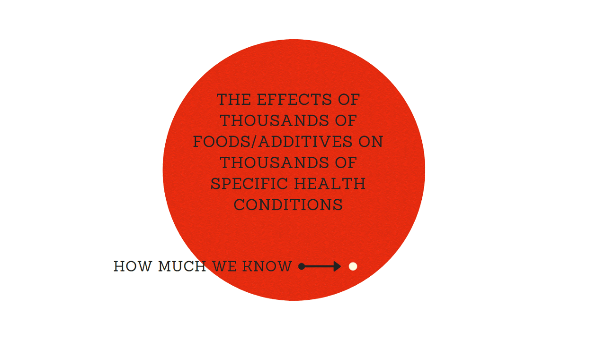
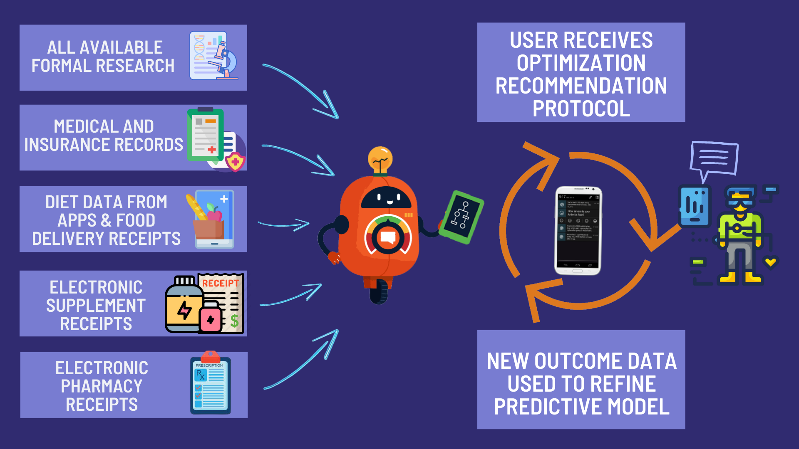

# 🤖 Optomitron Real-Time Decision Support Plugin


Optomitron in Action


#### [DEMO WEBSITE](https://demo.quantimo.do/dev/src/index.html#/app/chat)

Optimitron is an AI assistant that asks you about your symptoms and potential factors. Then she applies pharmacokinetic predictive analysis to inform you of the most important things you can do to minimize symptom severity.

.PNG>)

A half-billion are suffering from autoimmune diseases like Crone's disease, psoriasis, and Fibromyalgia. There’s also a great deal of mounting evidence that treatment-resistant depression and other mental illnesses are strongly related to immune dysregulation. What all these diseases have in common is that they can be exacerbated or improved by hundreds of factors in daily life.

.PNG>)

Probably the most significant is the 3 pounds of thousands of chemicals that we consume every day through our diets. Since the thousands of chemicals in our food have been GRAS or “Generally recognized as safe” by the FDA, there’s no incentive to do research.

We've built a connector framework that imports data on diet, physical activity, sleep, social interaction, environmental factors, symptom severity, vital signs, and others.

Then we apply pharmacokinetic predictive analysis that accounts for onset delays and durations of action. This enables her to obtain personalized effectiveness values (similar to recommended daily values) for treatments and reveal potential root causes of chronic conditions.

.png>)

The accuracy of the results obtained from quasi-experimental techniques and observational data is highly dependent on the quantity and quality of the data. To maximize the amount of available data, we're currently in the process of creating a decentralized autonomous organization called CureDAO. Its mission is to create an open-source platform for crowd-sourced clinical research. It incentivizes collaboration and data sharing by competing entities by issuing non-fungible tokens to any contributor of intellectual property or data.

Contributors of data and intellectual property will receive ongoing royalties for their contributions linked to their non-fungible tokens. We are currently meeting with investors and recruiting members. We plan to hold a fair and public auction for CureDAO tokens in May 2022.

## References

1. [SunilDeshpande\_S2014\_ETD.pdf (asu.edu)](https://keep.lib.asu.edu/\_flysystem/fedora/c7/114023/Deshpande\_asu\_0010E\_14022.pdf)
2. [LocalControl: An R Package for Comparative Safety and Effectiveness Research | Journal of Statistical Software (jstatsoft.org)](https://www.jstatsoft.org/article/view/v096i04)
3. [bbotk: A brief introduction (r-project.org)](https://cran.r-project.org/web/packages/bbotk/vignettes/bbotk.html)
4. [artemis-toumazi/dfpk (github.com)](https://github.com/artemis-toumazi/dfpk)
5. [miroslavgasparek/MPC\_Cancer: Model Predictive Control for the optimisation of the tumour treatment through the combination of the chemotherapy and immunotherapy. (github.com)](https://github.com/miroslavgasparek/MPC\_Cancer)
6. [Doubly Robust Learning — econml 0.12.0 documentation](https://econml.azurewebsites.net/spec/estimation/dr.html)
7. [A control systems engineering approach for adaptive behavioral interventions: illustration with a fibromyalgia intervention (nih.gov)](https://www.ncbi.nlm.nih.gov/pmc/articles/PMC4167895/)
8. [The promise of machine learning in predicting treatment outcomes in psychiatry - Chekroud - 2021 - World Psychiatry - Wiley Online Library](https://onlinelibrary.wiley.com/doi/full/10.1002/wps.20882)
9. [CURATE.AI: Optimizing Personalized Medicine with Artificial Intelligence - Agata Blasiak, Jeffrey Khong, Theodore Kee, 2020 (sagepub.com)](https://journals.sagepub.com/doi/full/10.1177/2472630319890316)
10. [Using nonlinear model predictive control to find optimal therapeutic strategies to modulate inflammation (aimspress.com)](https://www.aimspress.com/article/id/2665)
11. [Forecasting Treatment Responses Over Time Using Recurrent Marginal Structural Networks (nips.cc)](https://papers.nips.cc/paper/2018/hash/56e6a93212e4482d99c84a639d254b67-Abstract.html)
12. [Estimating counterfactual treatment outcomes over time through adversarially balanced representations | OpenReview](https://openreview.net/forum?id=BJg866NFvB)
13. [https://dash.harvard.edu/bitstream/handle/1/37366470/AGUILAR-SENIORTHESIS-2019.pdf?isAllowed=y\&sequence=1](https://dash.harvard.edu/bitstream/handle/1/37366470/AGUILAR-SENIORTHESIS-2019.pdf?isAllowed=y\&sequence=1)
